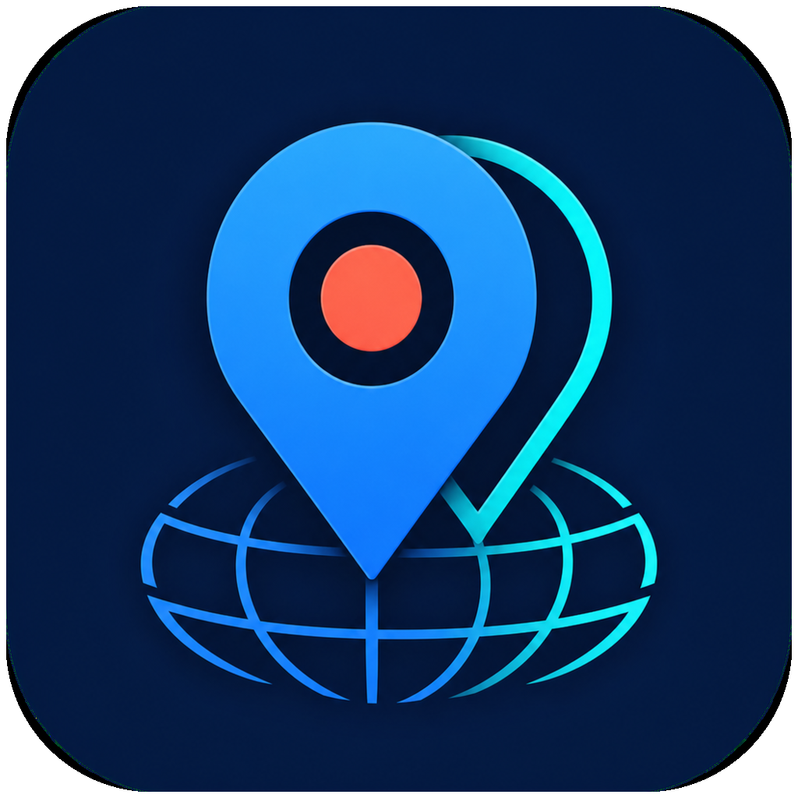

<p align="center">
  
</p>

<h1 align="center">GeoShift</h1>

<p align="center">
  A native macOS controller for simulating an iPhone's Core Location coordinates.
</p>

GeoShift keeps a selected location active on a connected iPhone, offers a
searchable catalog of 100+ cities, and reconnects automatically when the
developer tunnel is interrupted. It is intended for development, QA, demos,
and location-aware app testing.

## What it changes

GeoShift changes the coordinates reported by iOS Core Location while its
background worker is active. The selected coordinates are visible to apps such
as Maps.

It is **not a VPN**. It does not change:

- the phone's public IP address or network route;
- latency, bandwidth, DNS, or cellular provider;
- App Store country, system timezone, or device language.

An app can compare GPS coordinates with IP-derived location or detect simulated
locations. GeoShift does not attempt to hide simulation or bypass third-party
enforcement.

## Requirements

- macOS 14 or newer;
- an iPhone running iOS 17 or newer;
- Developer Mode enabled on the iPhone;
- the iPhone paired with and trusted by the Mac;
- Swift 6.2 or newer;
- Python 3.11–3.13 with
  [pymobiledevice3](https://github.com/doronz88/pymobiledevice3).

A USB cable is recommended for first-time pairing. After pymobiledevice3 enables
wireless connections, reconnection may also work when both devices are on the
same local network.

## Install from source

Install the backend with `uv`:

```bash
brew install uv
uv tool install --python 3.13 pymobiledevice3
```

Clone, build, and install the app:

```bash
git clone https://github.com/Lemelson/GeoShift.git
cd GeoShift
./Scripts/install_app.sh
```

The script builds a release binary, creates an ad-hoc signed app bundle, copies
it to `/Applications/GeoShift.app`, and opens it.

If macOS blocks the first launch, Control-click the app in Finder, choose
**Open**, and confirm once. Public binary releases are not currently notarized.

## First run

1. Connect and unlock the iPhone.
2. Tap **Trust** if iOS asks whether to trust the Mac.
3. Enable **Settings → Privacy & Security → Developer Mode** on the iPhone.
4. Open GeoShift and choose a destination.
5. Click **Start**.

GeoShift automatically selects the first available iPhone. The background
LaunchAgent keeps running when the controller window is closed. Click **Stop**
before disconnecting if you want to restore real GPS immediately; restarting
the iPhone also clears developer location simulation.

## Controls

- **Start** installs and starts the per-user background worker.
- **Stop** stops the worker and clears the simulated location.
- **Restart** rebuilds the developer tunnel.
- **Refresh** wakes a sleeping reconnect attempt within about 250 ms.
- **Choose city** searches destinations by city, country, or region.
- **Settings** controls reconnect and coordinate refresh intervals.

The configurable reconnect delay prevents a disconnected device from causing a
tight retry loop. Manual Refresh bypasses that delay without changing the saved
setting.

## Build and test

```bash
swift test
./Scripts/build_icon.sh
./Scripts/package_app.sh release
```

The app bundle is written to `GeoShift.app` in the repository root.

## Troubleshooting

**The app keeps waiting for an iPhone**

- unlock the phone and reconnect it by cable;
- confirm that Finder can see the iPhone;
- verify Developer Mode is enabled;
- keep the phone unlocked during the first developer-tunnel connection;
- click Restart after changing any of those conditions.

**pymobiledevice3 is missing**

GeoShift searches standard `uv`, `pipx`, Homebrew, and local-bin locations. The
recommended installation is:

```bash
uv tool install --python 3.13 pymobiledevice3
```

**The location returns to normal**

iOS clears simulation after a phone restart, and a developer tunnel can be
interrupted by sleep, network changes, or disconnection. Leave the background
worker running; it will reconnect and reapply the selected coordinates.

**Inspect the background service**

```bash
launchctl print "gui/$(id -u)/com.lemelson.geoshift.keeper"
tail -f "$HOME/Library/Logs/GeoShift.log"
```

## Architecture

The SwiftUI app writes a small JSON configuration and manages a per-user
LaunchAgent. The LaunchAgent runs the bundled Python worker using the
pymobiledevice3 environment installed on the Mac. The worker opens an iOS
developer tunnel and periodically applies the selected latitude and longitude.

No analytics, account system, cloud service, or remote server is included.
Configuration and logs remain under the current user's Library directory.

## Responsible use

Use GeoShift only on devices you own or are authorized to test. Location-aware
services may prohibit simulated coordinates in their terms, and accounts may be
restricted when those rules are violated. This project is a testing utility,
not an anti-detection or ban-evasion tool.

## License

GeoShift is available under the [MIT License](LICENSE). pymobiledevice3 is a
separate dependency distributed under GPL-3.0.
