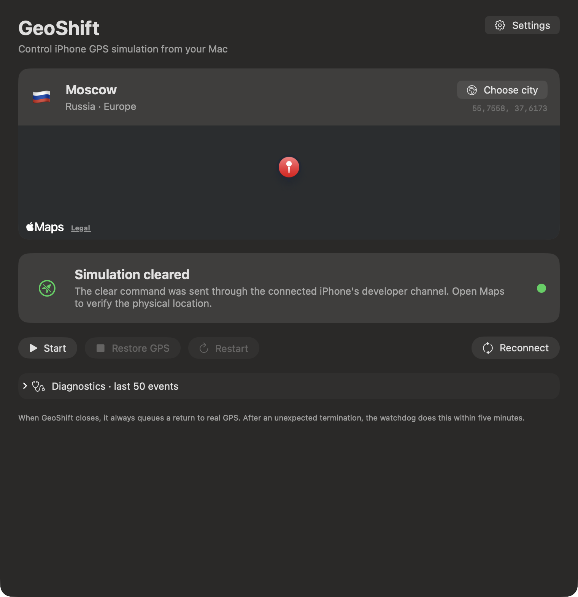

<p align="center">
  
</p>

<h1 align="center">GeoShift — iPhone GPS Simulator for macOS</h1>

<p align="center">
  Open-source macOS app for persistent Core Location simulation on a physical iPhone over USB or Wi-Fi.
</p>

<p align="center">
  <a href="https://github.com/Lemelson/GeoShift/actions/workflows/ci.yml"></a>
  
  
  
  <a href="LICENSE"></a>
</p>

<p align="center">
  
</p>

GeoShift is a native SwiftUI controller for simulating iPhone GPS coordinates
using Apple's developer location-simulation path through
[`pymobiledevice3`](https://github.com/doronz88/pymobiledevice3). It is designed
for iOS development, QA, demos, localization testing, geofencing tests, and
other authorized location-aware workflows on a physical iPhone.

It provides a searchable catalog of 100+ destinations, automatic reconnect,
iOS 27 cable-free pairing (verified on the current beta), English and Russian
interfaces, and a fail-safe
Restore GPS queue that survives app crashes and temporary phone disconnection.

> Common searches call this an “iPhone GPS spoofer” or “fake location” tool.
> GeoShift does not hide what it does: it uses developer location simulation,
> requires Developer Mode, and is intended for devices you own or are authorized
> to test. It does not jailbreak the phone or bypass simulation detection.

## Why GeoShift?

- **Physical iPhone testing:** simulate Core Location outside the iOS Simulator.
- **USB or Wi-Fi:** trusted USB, legacy Wi-Fi lockdown, and iOS 27 RemotePairing.
- **No cable on iOS 27:** the beta-tested assistant shows a six-digit pairing code.
- **Persistent and recoverable:** the worker reconnects after sleep or network loss.
- **Fail-safe Restore GPS:** exact-device identity, durable status, crash heartbeat,
  pending clear queue, and startup recovery prevent stale simulated locations.
- **English and Russian:** English is the first-run default; switch languages in
  Settings without restarting the app.
- **Private by design:** no analytics, account, cloud service, or remote server.
- **Transparent:** open-source SwiftUI controller and Python worker with regression tests.

## What GeoShift changes

GeoShift changes coordinates reported by iOS Core Location while developer
simulation is active. Maps and other location-aware apps can observe the selected
coordinates.

GeoShift is **not a VPN** and does not change:

- public IP address or internet country;
- network route, DNS, ping, bandwidth, or cellular provider;
- App Store country, timezone, locale, or device language.

Apps may detect simulated coordinates or compare GPS with IP-derived location.
GeoShift does not attempt to conceal simulation or bypass third-party rules.

## Compatibility

| Requirement | Support |
| --- | --- |
| macOS | 14 or newer |
| Swift | 6.2 or newer |
| Python | 3.11–3.13; 3.13 recommended |
| pymobiledevice3 | 9.31.0 |
| Physical iPhone | iOS 17+ with Developer Mode |
| Cable-free pairing | iOS 27 RemotePairing; currently beta-tested |
| iOS Simulator | Not targeted; use Xcode's built-in controls |

See the full [compatibility matrix and known limitations](docs/COMPATIBILITY.md).

## Quick install

Install the backend in an isolated `uv` environment:

```bash
brew install uv
uv tool install --python 3.13 'pymobiledevice3==9.31.0'
```

Clone, build, and install GeoShift:

```bash
git clone https://github.com/Lemelson/GeoShift.git
cd GeoShift
./Scripts/install_app.sh
```

The script creates an ad-hoc signed `/Applications/GeoShift.app` and opens it.
Public builds are not currently notarized; see the
[installation and Gatekeeper guide](docs/INSTALLATION.md).

## First run

1. Enable **Settings → Privacy & Security → Developer Mode** on the iPhone.
2. Open GeoShift and choose **Settings → Connection**.
3. On iOS 27, start the Wi-Fi assistant, then open iPhone
   **Settings → Developer → Paired Macs → Other Devices → GeoShift**.
4. Enter the six-digit code shown in GeoShift. This is normally a one-time step.
5. Alternatively, connect the unlocked iPhone by cable and confirm **Trust**.
6. Choose a destination and select **Start**.

The pairing permission does not need weekly or monthly renewal. See
[Pairing an iPhone](docs/PAIRING.md) for the exact flow and renewal conditions.

## Controls and safety behavior

- **Start** installs or wakes the background worker and applies the destination.
- **Restore GPS** sends a clear through the trusted developer tunnel. If the phone
  is offline, the request remains pending and completes when that exact phone returns.
- **Restart** rebuilds the developer tunnel when a connection is stuck.
- **Reconnect** immediately wakes a sleeping retry.
- **Choose city** searches English and Russian city, country, and region names.
- **Settings** controls language, reconnect timing, GPS refresh, and Wi-Fi pairing.

GeoShift writes an application heartbeat every 30 seconds. If the app crashes or
is killed, a missing heartbeat converts the active request into Restore GPS within
five minutes. Command-Q is refused when the app cannot confirm either a completed
clear or a durable handoff to the restore worker.

The UI reports **Simulation cleared** only after the no-reply `clear` command
returns successfully through the connected iPhone's developer channel. Apple's
developer API does not read back the physical GPS sensor, so open Maps for the
final sensor-side check. A missing worker, stale log, or disconnected phone is
never treated as proof.

Restarting the iPhone clears the current developer location simulation. If
**Start** is still requested and the worker remains active, GeoShift can reconnect
and apply it again; choose **Restore GPS** before restarting whenever possible.

## Build and test

```bash
swift test
PYTHONDONTWRITEBYTECODE=1 uv run --with 'pymobiledevice3==9.31.0' \
  python -m unittest discover -s Tests/Python -v
./Scripts/package_app.sh release
```

The package script builds the localized resource bundle, creates `GeoShift.app`,
and applies an ad-hoc signature.

## Documentation

- [Installation](docs/INSTALLATION.md)
- [USB and Wi-Fi pairing](docs/PAIRING.md)
- [Troubleshooting and diagnostics](docs/TROUBLESHOOTING.md)
- [Compatibility and limitations](docs/COMPATIBILITY.md)
- [Architecture and fail-safe state machine](docs/ARCHITECTURE.md)
- [Privacy and local data](docs/PRIVACY.md)
- [Uninstall and cleanup](docs/UNINSTALL.md)
- [Security policy](SECURITY.md)
- [Contributing](CONTRIBUTING.md)
- [Changelog](CHANGELOG.md)

## Architecture overview

The SwiftUI app writes atomic configuration and heartbeat state and manages a
per-user LaunchAgent. The LaunchAgent runs the bundled `keeper.py` using the
separately installed pymobiledevice3 environment. The worker opens a trusted
developer tunnel, durably marks that simulation may be active before sending a
location, and writes a separate atomic successful-clear status after the clear
command returns without error.

Human-readable logs rotate automatically. The UI reads only the latest 50 events
and keeps diagnostics collapsed by default. Runtime configuration, status, logs,
and pairing credentials remain outside the repository under the current user's
Library and pymobiledevice3 directories.

Read the detailed [architecture guide](docs/ARCHITECTURE.md) and
[privacy documentation](docs/PRIVACY.md).

## Troubleshooting

If GeoShift cannot see the iPhone:

- unlock the phone and keep both devices on the same local network;
- check the saved pair under **Settings → Connection**;
- allow Bonjour/local traffic through VPN or firewall software;
- retry the in-app pairing assistant on iOS 27+;
- use a trusted USB connection as a fallback;
- choose **Reconnect** after changing those conditions.

For stuck locations, pairing failures, Command-Q refusal, and safe log collection,
see [Troubleshooting](docs/TROUBLESHOOTING.md).

## Responsible use

Use GeoShift only on devices you own or are authorized to test. Location-aware
services may prohibit simulated coordinates, and accounts may be restricted when
their rules are violated. GeoShift is a testing utility, not an anti-detection,
ban-evasion, fraud, or access-control bypass tool.

## License

GeoShift is available under the [MIT License](LICENSE). pymobiledevice3 is a
separate runtime dependency distributed under GPL-3.0 and is not bundled into
the GeoShift app or repository.
